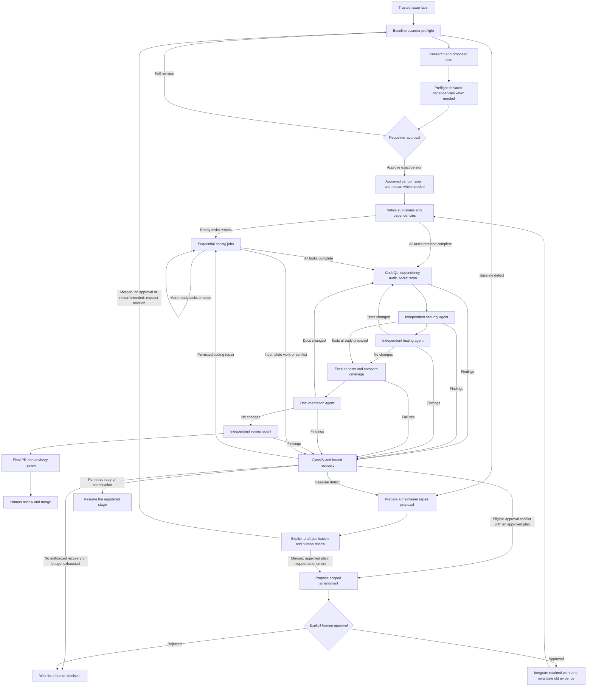

# Agentic SDLC Prototype

A GitHub-native, approval-gated delivery pipeline. Label an issue
`agentic-SDLC`; the controller preflights the baseline, then agents research it,
propose a plan and bounded repair permissions, implement tasks,
assess security, add tests, and review the integrated feature. A deterministic
controller creates the final PR only after every required gate passes.

**Automation is disabled until configured. Nothing here automatically merges
code.** This is a single-repository, sequential prototype for Node.js/TypeScript
projects, not a production-ready guarantee of correct or secure AI output.

## Lifecycle



Retry and continuation return to the registered stage: for example, an incomplete
Security review resumes Security, not coding. Task-local decisions may leave
unrelated ready work running; the recovery box summarizes these routes rather
than repeating every stage connection. A scoped amendment requires an existing
approved plan. Before approval, a repaired baseline needs a full `/sdlc revise`.

The original issue remains the epic. Task issues stay open until the final PR
merges; the controller's issue status comment records implementation progress.
A full revision starts over from the current default branch. A scoped amendment
instead retains implemented source, integrates an explicitly approved baseline,
and retains task completion only when structured requirements and task definitions
are unchanged. Both paths invalidate old gate evidence and retain cost history.

## Start Here

1. Run the local checks below.
2. Follow [GitHub setup and operations](docs/operations.md) to install a scoped
  GitHub App, configure environments, enable Copilot inference, and protect
  branches.
3. Commit and push the reviewed files to the default branch yourself. Both the
  Markdown agent workflow and its generated lockfile must be present there.
4. Set `SDLC_ENABLED` to `true` only after setup is complete.
5. Create a small issue with clear acceptance criteria, then have a repository
  writer apply the `agentic-SDLC` label.

To select the inference model for all SDLC agents, set the repository Actions
variable `SDLC_MODEL` to a supported Copilot model ID. Unset or empty values
default to `auto`. Updating this variable affects subsequent workflow runs
without editing or recompiling workflows.

Set the optional repository Actions variable `SDLC_AIC_CREDIT_LIMIT` to change
the AI credit cap for each agent and threat-detection inference job. Unset or
empty values default to `250`; accepted values are whole numbers from 1 to
10,000. The limit is validated and captured once per agent workflow, so changing
the variable affects subsequent runs without editing or recompiling workflows.

Initial state is created only from that authorized human `labeled` event. The
controller binds the request to the event's title and body; scheduled and manual
reconciliation cannot authorize an issue that was already labeled. If the label
was applied while automation was disabled, remove it and have a writer reapply
it after enabling the controller.

Research includes a **Technology and Architecture Decision**: application context,
product requirements, credible alternatives, a recommendation, pipeline support,
and any maintainer prerequisites. It must distinguish the application's needs
from the controller's stack. Unsupported recommendations are reported as blocked
with concrete prerequisites, not silently replaced with the controller's stack.
This guidance does not add new language support or weaken validation gates.

The controller posts a supported research plan with a version and stops. The
requester or a repository writer can approve that exact version with a new comment:

```text
/sdlc approve v1
```

To change the approach, post a new comment:

```text
/sdlc revise Keep the existing API and implement only the read-only view.
```

Only standalone commands in new, unedited human comments are accepted.
Ordinary discussion does not grant approval. An approval binds to the stored
plan hash, not an editable issue comment. Editing the original issue after
planning stops execution until the request is replanned.

| Command | Who | Effect |
| --- | --- | --- |
| `/sdlc approve vN` | Requester or writer | Approve the current plan |
| `/sdlc revise <feedback>` | Requester or writer | Replan; require approval |
| `/sdlc amend <feedback>` | Requester or writer; writer for trusted-baseline changes | Propose a source-preserving amendment to an already approved plan |
| `/sdlc approve-amendment vN` | Requester or writer; writer when specified | Approve the exact amendment and integration |
| `/sdlc reject-amendment vN` | Same required authority | Reject without discarding source |
| `/sdlc propose-maintenance JOB HASH` | Repository writer | Explicitly publish the exact baseline repair as a draft PR |
| `/sdlc pause` | Requester or writer | Invalidate active work and pause |
| `/sdlc resume` | Repository writer | Resume with a new job |
| `/sdlc retry` | Repository writer | Retry eligible legacy or infrastructure blocks; cannot override a structured decision |
| `/sdlc cancel` | Requester or writer | Stop the lifecycle permanently |

Closing the issue or removing the intake label also cancels execution. Once the
feature PR exists, use normal PR review; issue commands no longer restart it.

## Recovery

Structured blockers distinguish temporary failures, candidate defects, incomplete
work, approval conflicts, baseline defects, and unsafe output. The controller
verifies path authority, records attempted remedies, and uses bounded backoff,
targeted repair, checkpoint continuation, or an explicit approval path. Unrelated
ready tasks can continue after a task-local block, but not a repository-wide
trust failure. Repeated identical deterministic repairs stop spending budget.

Workers use the same path checker as publication. Their context names the actual
immutable baseline tests, and `node control/src/worker.ts check <path>...` checks
proposed paths. Approved task splitting preserves every original acceptance
criterion; it cannot add scope or evade total job limits.

Newly declared public npm vendor files are hash-verified and scanned before
implementation. Explicitly approved alternatives and exact security-patch paths
permit bounded recovery. Original and patched hashes are retained, licenses stay
unchanged, and the full security gate still must pass. This is not a general
package manager, scanner waiver, or permission to change protected manifests.

Approval conflicts can automatically produce a scoped amendment proposal, but
never an approval. Baseline defects produce a separate proposed patch, which
requires an explicit maintainer hash command before a draft PR is published.
Human review and merge remain mandatory. See [Recovery](docs/operations.md#recovery)
for commands, bounds, deployment, and retained-work recovery.

## Local Development

Use Node.js 24.8 or newer and npm. Docker is not required locally. The hosted
Agentic Workflow uses GitHub's sandboxing on Actions runners.

```sh
npm ci --ignore-scripts
npm run verify
```

Verification runs TypeScript checking, tests with coverage enforcement, and a
build. Tests use local fixtures and mocked GitHub responses, not live writes.
Ordinary CI also runs `CI / CodeQL` with the same security-extended findings
policy as SDLC. Local `npm run verify` does not run CodeQL.
Some negative fixtures deliberately run failing child tests; the outer test
runner must still finish successfully.

The agent workflow is compiled with GitHub CLI and the pinned extension:

```sh
gh extension install github/gh-aw --pin v0.88.7
npm run workflows:compile
gh aw compile sdlc-agent --actionlint
```

If the extension is already installed, verify its version before compiling.
Review and commit generated changes alongside the Markdown source. Do not edit
the generated lockfile manually. GitHub Agentic Workflows is in public preview;
compiler upgrades require deliberate review and validation.

## Implementation

| Component | Responsibility |
| --- | --- |
| [Controller](src/controller.ts) | Approval commands, state transitions, cost reconciliation, retries, publication gates |
| [Lifecycle model](src/lifecycle.ts) | Approved-plan integrity, commit-bound evidence, pending cost records |
| [Recovery](src/recovery.ts) | Blocker routing, amendments, permission-bound task splitting and retained work |
| [Dependencies](src/dependencies.ts) | Pinned artifact preflight, alternatives, integrity and patch provenance |
| [GitHub adapter](src/github.ts) | Compare-and-swap state, task links, authenticated run discovery, restricted publishing |
| [Worker](src/worker.ts) | Validate registered jobs and package bounded proposals |
| [Validation](src/validate.ts) | Actual tests, coverage comparison, scanner-result enforcement |
| [Policy](.github/sdlc/policy.json) | File restrictions, test discovery, thresholds, and execution budgets |
| [Agent workflow](.github/workflows/sdlc-agent.md) | Fresh Copilot execution for each specialized role |
| [Check workflow](.github/workflows/sdlc-checks.yml) | Deterministic security and testing jobs |

Authoritative JSON state is stored on `sdlc-state`. Writes use the previous
content SHA to reject conflicting updates. The controller is serialized;
scheduled reconciliation recovers established lifecycles after events are
coalesced by Actions concurrency or callbacks are missed. Initial intake still
requires a live authorized label event. Jobs are persisted before dispatch and accepted only from the
configured App, trusted workflow revision, expected job, and exact source SHA.

State uses `schemaVersion: 2`. Valid version-1 records, with or without cost
accounting, are upgraded automatically by the controller without resetting plans,
approvals, tasks, or evidence. Missing historical costs are marked as unavailable,
not reported as a zero-cost lifecycle. Follow [State Upgrades](docs/operations.md#state-upgrades)
before deploying to an existing installation; older controller and worker runs
must be stopped before version-2 state is written.

The optional `pendingCosts` queue preserves unsettled accounting independently
of the active job. Existing version-2 records load without it and keep their
totals unchanged. Older strict readers cannot load records containing this
extension, so deployment and rollback must retain support for it.

Recovery adds optional version-2 records for blockers, drafts, amendments,
preflight, dependency choices and patches, and execution-step bindings. Existing
records load without retroactive permissions or backfill. Deploy all controller,
worker, policy, profile, and generated workflow changes together after draining
old runs. Older strict readers cannot read these extensions. No live state or
repository settings are changed by local implementation or tests.

Workers receive read-only repository credentials. They return reports and text
changes as artifacts. The separate controller validates paths, sizes, stage
permissions, regular-file types, baseline tests, and branch history before
writing through the Git Data API. It never executes candidate code or artifact
scripts. A replay after a branch write can recover the already-published commit.

Coding maps acceptance criteria to checks, diagnoses repairs from current
scanner or test evidence, and verifies the changed consumer entry point with
approved tooling. Reports distinguish static checks, runtime execution, and
scanner results. Trusted preparation seeds incomplete coding and Security reports.
Valid, bounded `incomplete_work` checkpoints can seed a registered successor only
for the same source, plan, workflow revision, task, and execution step. The draft
is not published or accepted evidence; the successor must verify it. See
[Coding and Repair Evidence](docs/operations.md#coding-and-repair-evidence).

Security reviews keep provisional `blocked` checkpoints with reviewed areas,
findings, and outstanding work. Failed attempts receive diagnostic comments
with their job, commit, usage, stop signal, and any valid Security checkpoint.
Missing usage is reported as unavailable, not measured zero. Partial reports
from failed runs never supply passing evidence; see
[Incomplete Security Reviews](docs/operations.md#incomplete-security-reviews).
Budget telemetry does not yet independently gate acceptance.

Active-job cost-receipt errors cannot leave reconciliation retrying indefinitely.
Transient retrieval errors retry until the registered job timeout; invalid
receipts or exhausted retrieval retries consume the existing worker-failure
budget and mark cost history incomplete. The affected result is not accepted.
See [Cost Receipt Failures](docs/operations.md#cost-receipt-failures).

Cancellation, pause, timeout, and replanning retain unsettled job identities
before clearing active work. Missing telemetry is retried even after a stage
advances or the lifecycle ends, without accepting old results. Pending values
are excluded from totals until complete or until their fixed collection window
expires (90 minutes from first deferral by default). Settlement adds observed
values once; unavailable data is explicitly marked incomplete. This does not
reconstruct job identities already discarded by older controllers. See
[Deferred Cost Collection](docs/operations.md#deferred-cost-collection).

Testing derives a risk-based coverage map from approved behavior even when the
issue gives few test details. It must not invent missing product decisions or
use the implementation itself as the test oracle. Reports identify executed
tests, defects, and remaining checks; ambiguous behavior or unavailable required
validation is blocked. See [Test Design and Coverage](docs/operations.md#test-design-and-coverage).

Documentation may propose edits only within `policy.docsPaths`, with protected
paths and baseline tests still off limits. Accepted documentation changes trigger
renewed validation before final review; see [Documentation Edits](docs/operations.md#documentation-edits).

Every source change invalidates earlier gate evidence. Test additions trigger
new deterministic scans and a new security-agent review before validation and
final review. The final PR includes the approved plan, task context, workflow
evidence, and an advisory `COMMENT` review. `SDLC / Complete` is attached to the
reviewed commit, not to a mutable branch name.
The PR's Cost section also records `SDLC_MODEL` and `SDLC_AIC_CREDIT_LIMIT` as
configured at PR creation, defaulting to `auto` and `250`. These are not a
per-run settings history: `auto` is a model selector, and the cap applies to
each inference job rather than each turn. **Observed agent models** lists
concrete model IDs captured from primary-agent token-usage telemetry, separately
from that selector. Multiple models may appear; absent telemetry is shown as
unavailable, never inferred from `auto`. This covers available settled receipts,
not missing/legacy runs or separate threat-detection inference, and is not a
per-model billing breakdown. Model observations survive retries and replanning;
older records are not backfilled. Deploy controller and workflow together after
draining older runs; strict older readers reject the new optional model fields.
Existing PR descriptions are not rewritten when configuration, models, or costs
change. Cost totals are a creation-time
snapshot with any pending jobs explicitly excluded; the linked issue status
reflects later settlement.

The optional `usageHistory` ledger retains attribution after costs settle:
registered stage and persona, task and job/run IDs, original source and trusted
revisions, plan hash, requested model selector, observed models, and available
per-model request/input/output/cache-token counts. Accepted report outcomes and
resulting commits are recorded separately from mere usage. Missing telemetry
stays explicit, and retries do not sum the same token snapshot twice. Records
survive replanning and artifact expiration. This is collection only: no model
routing, lab classification, or new acceptance gates. See
[Retained Model Usage](docs/operations.md#retained-model-usage) for fields and limits.

Failed CodeQL gates include bounded rule, file, line, and severity diagnostics
in repair feedback when available, alongside the workflow evidence link. These
diagnostics are untrusted context, not permission to suppress a finding or pass
a failed check. See [Blocked Scan Repairs](docs/operations.md#blocked-scan-repairs)
before retrying a blocked lifecycle.
Agent-authored plan and evidence text has GitHub closing keywords neutralized
before publication, so only the controller-authored epic reference can close an
issue when the PR merges.

## Bounds and Limitations

- Six tasks, up to twelve approved execution steps per task, two automatic
 repair rounds, two attempts per recovery category and task/step, and
 forty total jobs per lifecycle by default. Manual retry does not reset the
 total job budget.
- Each agent execution has a 30-minute timeout. The per-inference-job AI credit
 cap is `SDLC_AIC_CREDIT_LIMIT` (default `250`), applied separately to agent and
 threat-detection jobs, not to their combined usage. Actions minutes are
 additional. Configure organization spending controls as well.
- Coverage must reach 80% lines and 70% branches, with no drop from the baseline.
 Coverage is a minimum signal, not a substitute for meaningful assertions.
- Existing baseline test files and automation policy are immutable to agents.
 In this repository, top-level controller source files are also protected.
 To adapt the pipeline to an application, review the source/test paths and
 protections in the trusted policy through a human-controlled change.
- Text changes only, with bounded file count and bytes. No binaries, symlinks,
 submodules, cross-repository tasks, or parallel integration. Scoped amendments
 use deterministic three-way tree integration. Overlapping application changes
 need exact maintainer-approved resolutions; protected paths and baseline tests
 cannot be resolved through that mechanism.
- Default-branch movement that touches a protected path requires replanning
  or a maintainer-approved scoped amendment against the new revision. Movement
 elsewhere is adopted between jobs. Recovery never grants itself new authority.
- Security scans are full candidate scans. Existing blocking vulnerabilities
 also prevent publication. CodeQL SARIF is retained as an artifact; it is not
 uploaded under the controller workflow's unrelated default-branch SHA.
- Agentic Workflows, scanner access, billing, and the first live issue-to-PR run
 must be verified in the configured GitHub repository. Local tests cannot
 establish those service-side permissions or entitlements.

## References

- [Experiment observations](docs/experiment-observations.md): measured learnings,
  risks, and unverified assumptions from the runs so far.

- [GitHub Agentic Workflows](https://docs.github.com/en/copilot/concepts/agents/about-github-agentic-workflows)
- [Agentic Workflow security](https://github.github.io/gh-aw/introduction/architecture/)
- [Workflow triggers and token behavior](https://docs.github.com/en/actions/how-tos/writing-workflows/choosing-when-your-workflow-runs/triggering-a-workflow)
- [Native sub-issues](https://docs.github.com/en/issues/tracking-your-work-with-issues/using-issues/adding-sub-issues)
- [Repository rulesets](https://docs.github.com/en/repositories/configuring-branches-and-merges-in-your-repository/managing-rulesets/available-rules-for-rulesets)
