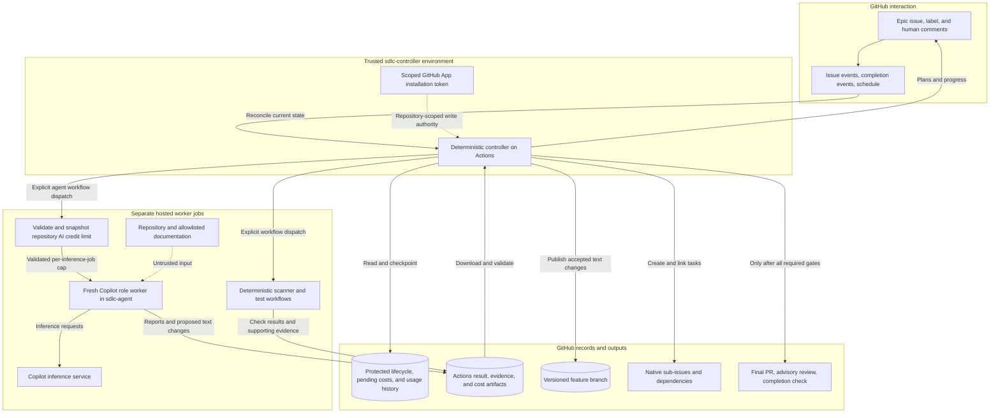
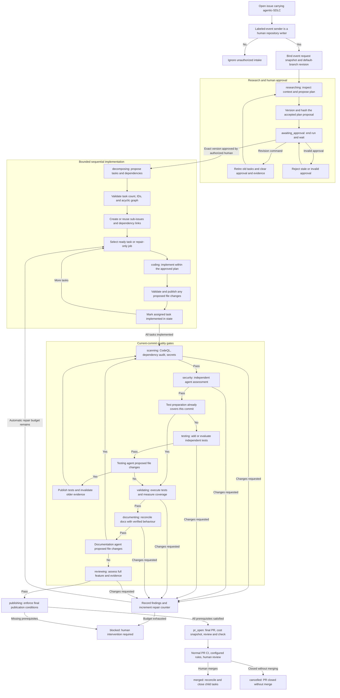
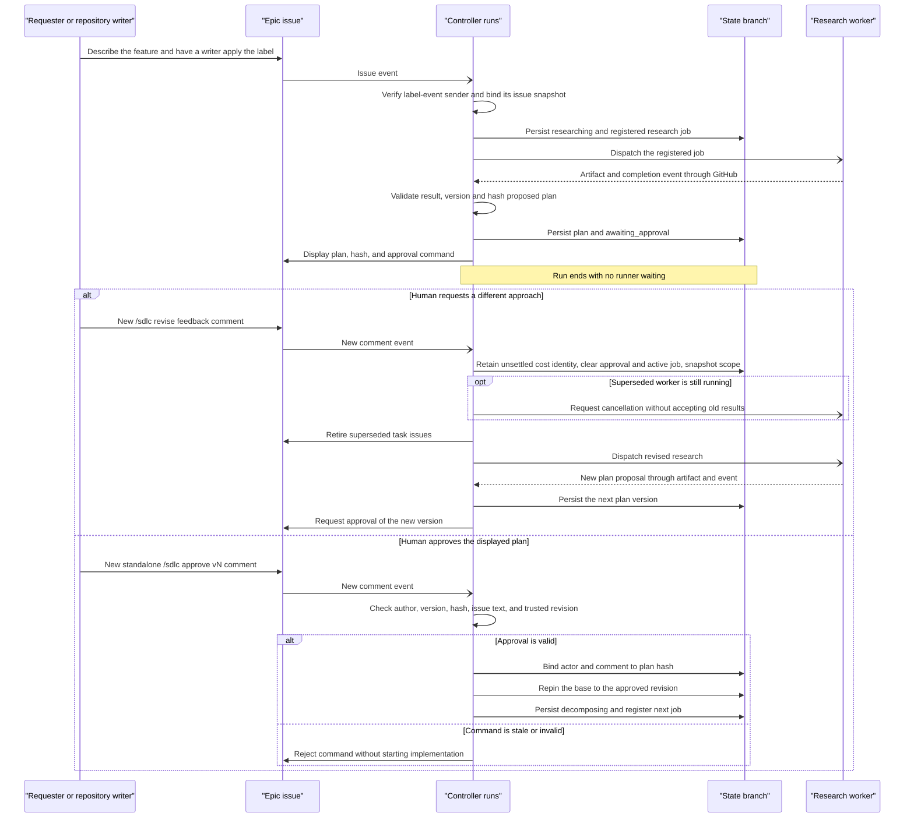
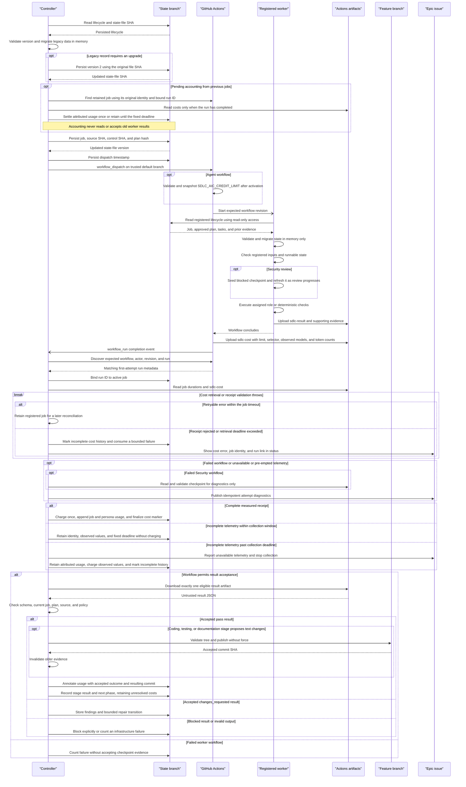
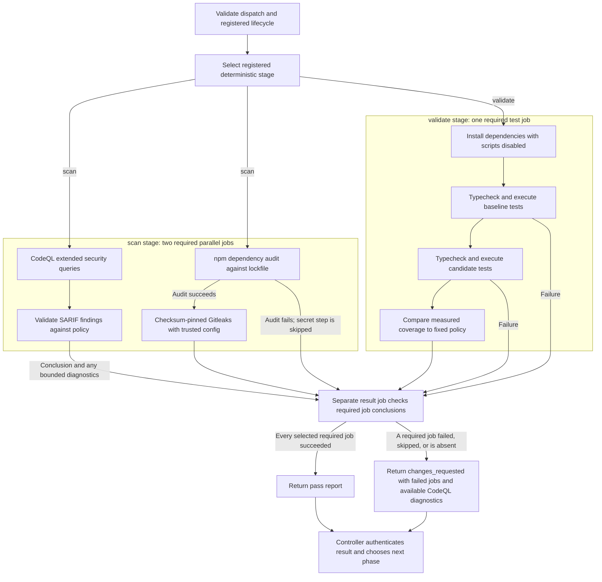
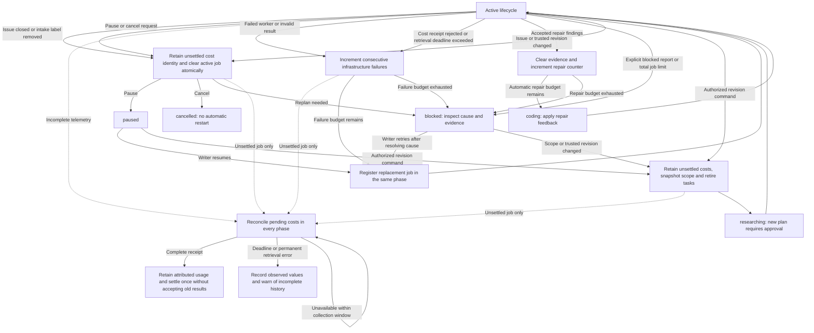
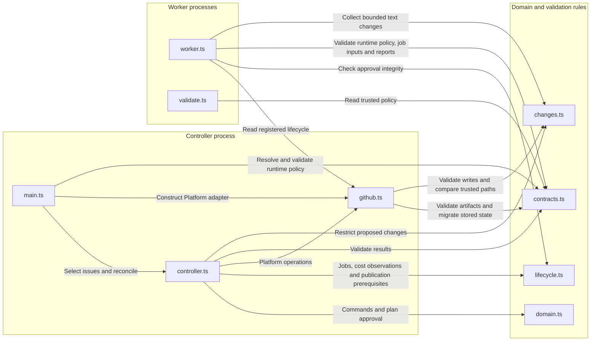

# Agentic SDLC Architecture

This document describes the implemented process from an `agentic-SDLC` issue
through research, human plan approval, task execution, security, testing,
independent review, and final PR publication. The controller makes lifecycle
decisions deterministically; agents propose plans, code, and assessments.

The scope is one GitHub repository, Node.js/TypeScript, and sequential coding
tasks. The diagrams describe implementation behavior, not proof of a successful
live deployment. See [operations.md](operations.md) for activation, credentials,
branch protection, and the first live pilot.

## Diagram Guide

- [Application Architecture](#application-architecture): services and trust zones.
- [Detailed Process Flow](#detailed-process-flow): the complete feature lifecycle.
- [Approval Conversation](#approval-conversation): requester decisions and revisions.
- [Worker Handoff](#worker-handoff): dispatch, artifacts, and result acceptance.
- [Security and Testing](#security-and-testing): deterministic gate execution.
- [Recovery Flow](#recovery-flow): pauses, repairs, retries, and cancellation.
- [Component Relationships](#component-relationships): implementation ownership.
- [State and Evidence](#state-and-evidence): durable records and publication rules.

Solid arrows show control or data flow. Dotted arrows show credentials or
supporting context. A gate's outgoing edge labels state the decision; agents
cannot choose an unauthorized transition merely by requesting it.

## Application Architecture

Everything runs through GitHub Actions and GitHub APIs. There is no locally
hosted controller, separate webhook receiver, database server, or message broker.

<!-- mermaid-checked: safe quoted labels, unique IDs, closed subgraphs -->

### Technology Stack

| Layer | Technology | Version | Purpose |
| --- | --- | --- | --- |
| Control | Node.js | 24.8+ | Run the controller and validators |
| Source | TypeScript | Pinned | Model state and API contracts |
| Agents | gh-aw and Copilot | gh-aw v0.88.7 | Compile and run role workers |
| API | Octokit | Pinned | Access GitHub REST APIs |
| Contracts | Zod | Pinned | Validate state and worker reports |
| Evidence | Actions artifacts | Managed | Transfer reports between runs |
| Security | CodeQL, npm audit, Gitleaks | Pinned where applicable | Scan code |
| Testing | Node test runner and c8 | Pinned where applicable | Test and cover |

State and source changes are stored in separate Git branches. GitHub Issues
provides the human interface, while Actions artifacts carry worker output.
Copilot inference, npm advisories, and allowlisted documentation are external
dependencies; unavailable services do not automatically waive a gate.

### Key Decisions

- **Separate reasoning from authority.** Workers have read-only repository
  access. Only the controller receives the App token used for publishing.
- **Keep state outside the conversation.** Versioned JSON is authoritative;
  comments are commands, proposed-plan displays, or progress projections.
- **Publish the PR last.** Intermediate work lives on a feature branch. Agent
  review precedes PR creation; its native `COMMENT` review is attached afterward.

The hosted agent runtime uses sandbox containers. Local development and
documentation rendering do not require Docker. Deterministic check jobs are
separate Actions jobs, not additional Copilot agents.

## Detailed Process Flow

The labels `researching`, `awaiting_approval`, and so on are persisted lifecycle
phases. Transitions below assume the worker result has passed the acceptance
checks described in [Worker Handoff](#worker-handoff).

The [Research profile](../.github/agents/research.agent.md) requires a Technology
and Architecture Decision in proposed plans. It separates the application's
baseline from controller tooling, compares product-fit options, recommends
components and data flow, and independently assesses pipeline support and
maintainer prerequisites. Unsupported implementation or validation requires a
`blocked` report with actionable details in `summary`, using the existing
blocked-result path rather than creating an executable plan with unapproved
prerequisites. These are agent instructions, not new schema-enforced plan fields;
human plan review and deterministic path, revision, and validation gates remain
necessary. The pipeline still targets Node.js/TypeScript.

<!-- mermaid-checked: safe quoted labels, unique IDs, closed subgraphs -->

Important details behind the diagram:

1. A lifecycle is created once per issue. Relabeling or reopening does not
   restart a permanently cancelled lifecycle.
2. Task selection uses the first incomplete task whose dependencies are all
   implemented. There is one registered active job per lifecycle, even when
   multiple tasks are independent.
3. The controller records a testing-stage result on the commit containing the
   accepted tests. It then reruns scanning and security, preserving that new
   test-preparation evidence so testing does not loop indefinitely.
4. Any subsequent code change clears earlier evidence. Repair feedback also
   clears evidence, even when a repair later produces no file changes.
5. Tasks marked implemented in state remain open as GitHub issues until merge.
   The final PR contains `Closes #<epic-number>`; GitHub handles epic closure
   on merge to its default branch, and reconciliation closes child tasks.
6. Invalid output, missing artifacts, pauses, and scope drift follow the
   separate [Recovery Flow](#recovery-flow), not an unconditional success edge.
7. Pending cost reconciliation is independent of these phases. It may continue
  after cancellation or merge but never authorizes a worker result or new work.

## Approval Conversation

Approval is an issue-comment protocol, not a model-generated decision and not
a runner waiting for keyboard input. Each event starts a short controller run.

<!-- mermaid-checked: quoted participant aliases, closed conditional blocks -->

Only new, unedited human comments with standalone recognized commands are
processed, once per comment ID. The requester may approve or revise after
trusted intake, even if they are not a repository writer. Writers may also
approve. Commands from other users are ignored; valid authors receive rejection
feedback for invalid state or stale versions.

A first lifecycle can only be created from an authorized human label event, not
from a later schedule or manual reconciliation. If the issue changes after that
event, the event snapshot remains authoritative and execution blocks before a
worker is dispatched. A revision snapshots the current issue and default branch, invalidates the
active job, clears approval and evidence, retires existing tasks as not planned,
and chooses a new versioned feature branch. Older branches and unsettled cost
identities are retained; accounting uses their original commit and plan bindings.
An edited issue requires replanning before execution can continue, as does any
default-branch movement that touches a protected path. Movement outside those
paths is adopted between jobs instead of blocking. `/sdlc retry` does not
authorize changed scope.

## Worker Handoff

Both agent and deterministic workers use the same durable job protocol. A
completion event is only a reconciliation hint, not sufficient proof that the
result belongs to the lifecycle.

<!-- mermaid-checked: quoted participant aliases, closed conditional blocks -->

The adapter selects the expected worker file from the registered stage:

- `research`, `decompose`, `code`, `security`, `test`, `document`, and `review`
  use the [compiled agent workflow](../.github/workflows/sdlc-agent.lock.yml).
- `scan` and `validate` use the
  [deterministic check workflow](../.github/workflows/sdlc-checks.yml).

All seven agent stages select the inference model at workflow runtime from the
repository variable `SDLC_MODEL`, falling back to `auto` when it is unset or
empty. The model choice does not change worker permissions or result acceptance.
The configured selector is distinct from concrete model IDs reported by runtime
token-usage telemetry. Available observations are informational cost metadata;
`auto` is never treated as a resolved identity and need not select the same model
for every stage or inference.

The credential-free `budget` job validates `SDLC_AIC_CREDIT_LIMIT` after
activation, defaulting to `250` when unset or empty. It accepts decimal integers
from 1 to 10,000. Its output is passed to both inference jobs through
`engine.env.GH_AW_MAX_AI_CREDITS` and to the worker's runtime policy. The
primary agent and threat detector enforce the same configured cap separately;
their combined usage is not bounded by a single shared counter. Invalid
configuration prevents either inference job from starting.

Acceptance requires the controller App as the run actor, the registered trusted
workflow commit, the expected job name and workflow, and `run_attempt == 1`.
The report supplies `jobId` and `inputSha`; stage, task, and plan authority come
from the registered job, not arbitrary fields supplied by an agent.

The controller accepts one unexpired `sdlc-result` artifact, with bounded
compressed and result-file sizes. It parses `result.json` as data and never
executes downloaded code. Agent proposals remain untrusted even when their
workflow provenance matches.

The separate `sdlc-cost` artifact is written by a workflow post-step rather than
by the agent, so it records what the run actually consumed rather than what the
agent claims. Deterministic check runs upload no such artifact and are charged
runner time only.

For deterministic checks, the dedicated `SDLC Check Result` job must succeed.
That job can report a failed scanner or test even when the overall workflow
conclusion is `failure`. A failed agent workflow has no equivalent exception.

## Security and Testing

Security uses ordinary tools in addition to agent reasoning. Coverage is
measured by executing tests, not by accepting a model's estimated percentage.

<!-- mermaid-checked: safe quoted labels, unique IDs, closed subgraphs -->

`scan` requires `prepare`, `codeql`, and `security`. `validate` requires
`prepare` and `tests`; jobs for the other stage are intentionally not required.
If preparation fails, the result job cannot produce an accepted report.

The current checks include:

- **CodeQL:** JavaScript/TypeScript, `security-extended` queries, and build mode
  `none`. SARIF is evaluated locally and retained as an artifact, not uploaded
  against the workflow's unrelated default-branch commit.
- **Dependencies:** npm audits the candidate lockfile and blocks high or
  critical vulnerabilities. Failed or malformed audit output cannot pass.
- **Secrets:** Gitleaks v8.30.1 uses a checksum-pinned binary and trusted
  configuration. Findings block the gate; source-controlled ignore files and
  inline allow comments cannot suppress them in this workflow.
- **Tests:** baseline and candidate dependencies are installed without npm
  lifecycle scripts. A trusted runner invokes TypeScript and Node tests with
  c8, using test and source patterns from policy.
- **Coverage:** at least 80% lines and 70% branches, with no permitted drop from
  the baseline. Missing tests or invalid coverage data fail validation.

On SARIF validation failure, the validator emits JSON-encoded diagnostics through
a job output. Blocking findings include at most ten rule IDs, source locations,
and severities, with bounded metadata fields and no source snippets. The result
job carries at most 6000 characters into repair feedback, labeled as untrusted
scanner data, only when CodeQL did not succeed. Missing, malformed, or oversized
diagnostics fall back to the failed job names and run link; they cannot turn a
failed check into a pass. The full SARIF remains in the `sdlc-codeql` artifact.
Registered job, approved plan, trusted revision, and source-commit checks remain
unchanged.

The security and final review agents assess the complete integrated diff and
available evidence. They are advisory assessments with limited tool access,
not proof that a feature is free of defects. Native GitHub rules and human
review remain necessary at the PR boundary.

The [Testing profile](../.github/agents/test.agent.md) first derives a risk-based
coverage map from approved behavior and public contracts, with independently
justified expected results. Missing test details may be filled in; undefined
product rules require clarification. Reports distinguish tested behavior,
demonstrated defects, unavailable tooling, and unfinished or approved later human
checks. Production defects return `changes_requested` with a reproduction in
the summary because that path does not apply proposed test changes. Ambiguity
or incomplete required testing returns `blocked`. The existing `pass` path
still leads to independent scans and deterministic validation as shown above.
These are prompt-level completeness rules, not new schema-enforced fields or
browser-validation capabilities. Test-only scope and baseline immutability at
`state.baseSha` are unchanged.

The Security profile requires explicit coverage, findings, outstanding checks,
and a handoff. It prioritizes high-risk paths without silently dropping other
applicable review areas. Trusted preparation seeds a provisional `blocked`
result after checking the registered job; the agent refreshes it through the
normal collect command as work progresses. The final post-step attempts to
upload the last packaged result even if inference fails. This is best-effort
capture, not continuous remote storage; abrupt runner termination can lose it.
Checkpoints from failed workflows are only diagnostic and cannot create
Security evidence. A successful workflow returning `blocked` follows the normal
blocked-result path. There is no new schema-level proof of review completeness.

## Recovery Flow

The controller records state before dispatching work or invalidating a job.
Only recognized, current results can advance a running lifecycle.

State validation and any required migration must succeed before this phase-based
recovery flow runs. A schema error or failed migration write stops reconciliation
for that issue without changing its lifecycle phase.

<!-- mermaid-checked: safe quoted labels, unique IDs, closed subgraphs -->

### Recovery Rules

- **Duplicate events:** reuse the issue lifecycle and active job. Commands are
  deduplicated by comment ID; repeated side effects reuse controller-owned
  markers or existing linked resources.
- **Lost dispatch:** wait up to 10 minutes for a matching run, then allow one
  additional dispatch of the same job identity. Exhaustion counts as an
  infrastructure failure; a replacement job receives a new identity.
- **Timeout:** after 90 minutes from job creation, reconciliation cancels an
  unfinished run and counts a failure. Agent and check jobs have their own
  shorter Actions time limits.
- **Infrastructure failures:** two consecutive failures block the lifecycle.
  Successful results reset this counter. A missing or malformed scanner report
  is not a clean scan.
- **Artifact retrieval:** transient `404`, `408`, `429`, rate-limited `403`, and
  `5xx` responses, plus an empty result-artifact listing, retain the completed
  registered job for retry until its job timeout. Persistent retrieval failure
  then consumes one infrastructure failure.
- **Active-job cost retrieval:** thrown transient errors retain the current job until the
  same timeout. Malformed receipts, non-retryable download errors, or transient
  errors past that deadline consume one worker failure without reading or
  accepting the result. Known totals are preserved, cost history is marked
  incomplete, and the issue status identifies the error and run. The existing
  consecutive-failure budget bounds replacement attempts before blocking.
- **Deferred costs:** interrupted jobs and incomplete receipts retain a compact
  original job identity outside active-job authority. Discovery and cost reads
  continue in every phase, with cancellation retried for abandoned running
  jobs. A fixed window of `jobTimeoutMinutes` starts at first deferral and is
  never extended by retries or replanning. Complete observations are settled
  once. A permanent retrieval error or still-missing data after the deadline
  records only known values, marks incomplete history, and stops collection.
  These accounting failures do not consume the current worker's failure budget.
- **Repair findings:** accepted `changes_requested` after decomposition return
  to coding, with two automatic repair rounds. The same outcome from research
  or decomposition counts as a failed stage instead.
- **Manual controls:** requester or writer may pause, revise, or cancel.
  Only a writer may resume or retry. Retry clears infrastructure failures, not
  the total-job or repair counters, and cannot bypass unchanged prerequisites.
- **Late output:** interruption retains any unsettled cost identity and clears
  the active job in one state write before requesting worker cancellation.
  Late costs can be collected; late results cannot authorize their own acceptance.
- **Partial publication:** if a commit was written before interruption, recovery
  verifies its parent, proposal digest, and complete expected file tree. A
  matching commit message alone is insufficient.
- **State races:** updates include the prior state-file SHA. Conflicting writes
  fail instead of silently overwriting another checkpoint. A future controller
  run reloads state; GitHub API calls and state writes are not one transaction.
- **Attempt diagnostics:** failed workflows and telemetry warnings produce a
  comment keyed by job and run before their cost is checkpointed. A failed
  Security result is validated for identity and read-only changes before its
  bounded summary is displayed as untrusted progress. Neither that summary nor
  its claimed outcome is used to accept failed work. Comment retries are
  idempotent, and a failed comment write leaves the cost unrecorded for retry.

The schedule reconciles every 10 minutes and can recover established lifecycles
after events are coalesced by Actions concurrency. Initial lifecycle creation
still requires a live authorized label event. Manual dispatch can reconcile one
issue or all known lifecycles. Turning `SDLC_ENABLED` off prevents new starts and transitions, but
already-running jobs must also be cancelled for an immediate emergency stop.

Once `pr_open` is reached, normal PR review owns further interaction. The
controller observes merge or closure; it does not autonomously respond to PR
review comments or rerun the lifecycle for subsequent PR pushes. Pending cost
collection and the issue's cost status can still progress, including after merge.

## Component Relationships

These are modules within Actions jobs, not separately deployed services.
`Platform` is the controller's boundary for GitHub effects and local test fakes.

<!-- mermaid-checked: safe quoted labels, unique IDs, closed subgraphs -->

### Component Inventory

| Component | Layer | Type | Responsibility |
| --- | --- | --- | --- |
| [Entry](../src/main.ts) | Control | CLI | Select issues and reject stale runs |
| [Controller](../src/controller.ts) | Control | Orchestrator | Reconcile stages and pending costs |
| [Domain](../src/domain.ts) | Domain | Rules | Parse commands and hash plans |
| [Lifecycle](../src/lifecycle.ts) | Domain | Ledger | Jobs, tasks, evidence, cost observations |
| [Contracts](../src/contracts.ts) | Validation | Schemas | Parse untrusted data |
| [Changes](../src/changes.ts) | Validation | Policy | Restrict paths and sizes |
| [GitHub](../src/github.ts) | Effects | Adapter | State and repository writes |
| [Worker](../src/worker.ts) | Execution | CLI | Prepare and package results |
| [Validator](../src/validate.ts) | Execution | CLI | Run tests and enforce gates |

## State and Evidence

### Domain Records

| Record | Meaning and relationship |
| --- | --- |
| Epic | Original request and human discussion; owns one lifecycle |
| Plan | Versioned proposed scope; implementation needs its approval |
| Approval | Human actor and comment bound to an exact plan hash |
| Task | Bounded work item in the approved plan's dependency graph |
| Job | One registered attempt to execute a stage against a commit |
| Pending cost | Original job identity, fixed expiry, and optional observed measurements; not execution authority |
| Usage history | Settled job/persona attribution, observed model/token metadata, and any recorded accepted-result commit; not gate evidence |
| Evidence | Accepted stage summary and run reference for one commit |
| Feature PR | Published integrated feature, awaiting normal human review |

State is stored as `issues/<number>.json` on the protected `sdlc-state` branch.
That branch is initialized with an isolated root commit, separate from feature
history. The default feature branch pattern is `agentic/epic-<number>-v<version>`;
the branch is created lazily when the first accepted text change is published.

### Schema Migration

New records and all writes use `schemaVersion: 2`. The shared loader validates
either version 2 or the known version-1 formats, which may have no `spend` object
or an existing cost ledger. `migrateLifecycle` converts version 1 in memory and
does not change phase, plan text or hash, approval, tasks, evidence, job identity,
commit bindings, or existing cost counters. Malformed data and unknown versions
are rejected; current-version writes never apply implicit defaults.

`pendingCosts` is an optional version-2 extension, bounded to 100 entries by
the maximum supported lifecycle job budget. Records without it remain valid
without resets or a migration write. Entries reject unexpected authority fields
and duplicate job IDs, and the field is removed when the queue empties. Older
strict version-2 readers do not support this extension; rollback must preserve it.

Optional `models` arrays extend cost receipts, pending observations, and `spend`.
They hold bounded concrete model IDs, with up to 20 IDs captured per run and
2,000 accumulated across the maximum 100 jobs. Legacy records load without them
and are not backfilled. Older strict readers reject these fields too, so the
controller and compiled workflow must be deployed together after draining old
runs, and rollback must retain model-field support. Model availability is not a
new migration or acceptance condition.

Optional `usageHistory` retains up to 100 unique registered jobs and rejects
duplicate known run IDs or mismatched stage/persona pairs. Retained identities
can also include the task and dispatch-attempt counter. Optional receipt fields
`requestedModel` and `tokenUsage` preserve selector and token observations.
Pending and settled records may include controller-accepted result metadata.
Existing records without these fields load unchanged; no history is inferred
from aggregate totals. Deployment and rollback must retain the upgraded readers.

The storage adapter returns a transient `needsMigration` flag alongside the
original file SHA. Only the controller saves the upgrade, before any command,
PR processing, or terminal-state early return. This includes `pr_open`, `merged`,
and `cancelled` records. Workers use the same read-only loader and cannot persist
an upgrade. Migration is idempotent: an uncommitted write can be retried, a lost
acknowledgement is resolved by reloading, and stale writers fail the existing
SHA concurrency check. The flag is not stored in the lifecycle JSON.

The migration does not authorize new work or relax trusted-revision checks.
Deploy only after older controller and worker runs are idle, following
[State Upgrades](operations.md#state-upgrades).

### Revision Bindings

| Binding | Purpose |
| --- | --- |
| `baseSha` | Baseline source and tests for this plan's implementation |
| `controlSha` | Trusted workflow and automation revision |
| `headSha` | Latest controller-accepted feature commit |
| `plan.hash` | Immutable plan content and version fingerprint |
| `job.inputSha` | Source commit supplied to a particular worker |
| `job.runId` | Accepted GitHub run for the registered job |
| `spend` | Cumulative recorded runner time and AI credits |
| `spend.models` | Optional distinct concrete model IDs observed in settled primary-agent receipts; informational, not a complete model history |
| `spend.historyComplete` | `false` when historical or finalized cost telemetry is unavailable |
| `pendingCosts` | Unsettled original job identities, fixed collection deadlines, and optional observed values excluded from totals |
| `usageHistory` | Durable per-job stage/persona, model and token observations, original bindings, and any accepted outcome/output commit |

At initialization, approval, and replanning, baseline and controller SHAs are
captured from the default branch. `baseSha` then remains fixed while the
candidate head advances. Dispatch inputs carry the issue, job, stage, candidate
SHA, and controller SHA.

`controlSha` tracks the default branch rather than pinning one commit for the
whole lifecycle, because `workflow_dispatch` always runs at the head: a pin left
behind by unrelated commits would fail every worker's revision gate and stall the
lifecycle silently. Between registered jobs the controller compares its pinned
revision with the current head and adopts the head when no protected path
differs. A protected-path difference means the trusted harness itself moved, so
the lifecycle is blocked for replanning instead. Anything the comparison cannot
judge cleanly — a revert, a force push, or a diff at the API's file cap — is
treated as a protected-path change. The protected set is the one in
`policy.json`, so the paths agents may not write are exactly the paths whose
movement invalidates their work.
The persisted job links those inputs to the approved plan and selected task.

### Publication Preconditions

Before creating the final PR, the controller requires:

1. An intact plan whose hash matches the recorded human approval.
2. Phase `publishing`, no active job, and at least one task.
3. Every task marked implemented and a head commit different from the baseline.
4. Accepted `scan`, `security`, `test`, `validate`, `document`, and `review` evidence on the
   exact candidate head SHA.
5. The working branch still pointing to that reviewed commit.

Publication creates or reuses the feature PR, posts the reviewer's report as an
advisory `COMMENT`, and publishes `SDLC / Complete` on the reviewed SHA. The App
does not approve or merge the PR. Configured branch rules, normal CI, and human
review govern merging. Selecting the App as the required check's expected
source is an installation step, not something these workflows configure.

### Cost Accounting

Complete worker costs are charged exactly once to `spend`. The active job's
`costedRun` marker and the tally are saved together; deferred settlement removes
its pending entry in the same SHA-checked write as the tally update. Reloading
after a failed write or lost acknowledgement cannot double count. This includes
rejected and failed results, cancelled workers, and superseded plans. Unlike
evidence, costs survive a change of head commit or plan.

The same settlement write appends a `usageHistory` entry with a copied original
job identity and its assigned persona, derived by the controller rather than
the receipt. Repeated settlement of the same identity is a no-op; conflicting
identities or duplicated known run IDs are rejected. Missing observations are
omitted, never synthesized from current settings. Jobs that were never
discovered retain identity without a fabricated run ID or charge. The history
survives pending cleanup, replanning, source changes, and artifact expiry.

Normal result acceptance separately annotates its pending or settled usage with
`acceptedResult` (outcome and resulting commit). Rejected or stale results and
failed agent workflows are not annotated. Accounting never reads an abandoned
result to fill this field, and historical accepted results never replace
current-commit gate evidence. No routing or diversity policy consumes the ledger.

Before clearing a dispatched, uncosted job, interruption and replanning retain
its ID, stage, original source and trusted revision, plan hash, creation time,
and any discovered run ID in `pendingCosts`. Incomplete receipts also retain
their observed values there even when the stage advances. Pending observations
are not yet included in totals. Repeated observations preserve known values,
use the largest observed runner duration rather than summing repeated reads,
and retain an observed credit-limit snapshot and concrete model IDs when later
reads omit them. Model IDs are deduplicated and sorted, not counted as new runs.
The first observed requested selector is retained. Token observations use a
single best snapshot, preferring available over partial and then more requests;
retries never add snapshots together or erase a better one with missing data.

Every reconciliation processes abandoned accounting before terminal-state
returns, matching the original workflow, actor, revision, job, and first run
attempt. It never reads a historical result or mutates approval or evidence.
Abandoned running workers receive renewed cancellation requests. Transient
lookup, cancellation, and receipt failures do not block unrelated stage progress.
The fixed collection window is `jobTimeoutMinutes` from first deferral (90
minutes by default), not a deadline refreshed by each poll. If data is still
missing after that window or retrieval fails permanently, an idempotent
accounting diagnostic identifies the job; only observed values are settled and
history is marked incomplete. Nothing is invented for an undiscovered run.

The current active job keeps the existing bounded error path: thrown permanent
or expired retrieval errors consume one worker failure without accepting the
result. Any previously observed pending values are settled once, its entry is
removed, and history is marked incomplete. Deferred-only failures do not fail a
newer job. Missing telemetry itself remains observational, not a new gate.

At PR creation, the publisher includes the controller's configured `SDLC_MODEL`
and resolved `SDLC_AIC_CREDIT_LIMIT` in the Cost section, with defaults of `auto`
and `250`. These are a publication-time configuration snapshot, not per-run
history or a resolved inference-model identity. The cap applies separately to
each inference job, not each turn. Existing PR descriptions are left unchanged
on publication retries, even if repository variables or settled costs have
since changed. Totals are also labeled as a creation-time snapshot, with pending
jobs explicitly excluded and a link to the issue's updating lifecycle status.
Pending accounting does not delay an otherwise eligible publication.

The Cost section also lists **Observed agent models**, independently of the
configuration snapshot. The post-step reads concrete `model` IDs from the
primary agent's structured `token-usage.jsonl`, rather than from agent prose or
the configured selector. Missing/unreadable logs, malformed records, oversized
files, `auto`, and `unknown` cannot invent a concrete model. Logs are opened as
regular non-symlink files, limited to 5 MB, and model IDs are restricted to bounded
display-safe text. No usable IDs means `unavailable`. These runtime observations
are diagnostic metadata, not attestation, acceptance evidence, or billing truth.
They do not alter credit calculations, retry deadlines, or gates. Model history
is not backfilled, and absence does not change `spend.historyComplete`.

The post-step also captures the workflow's configured selector in
`requestedModel` and per-model request/input/output/cache-read/cache-write
counts in `tokenUsage`, without changing AI-credit calculations. Repeated
nonempty request IDs are counted once. Malformed records, missing/invalid
counts, or the 20-model cap make telemetry partial; a missing count is `null`,
not measured zero. No concrete models means unavailable telemetry. Counters
preserve the runtime's cache semantics, which can overlap with input counts;
they are not normalized across labs or translated into per-model billing.
The 10 KB receipt limit remains unchanged. Token availability is not a new
stage gate or a reason to extend collection deadlines.

Model lists cover available settled primary-agent receipts, not all inference:
legacy/missing telemetry and the separate threat detector are not covered.
Several models may appear, including with automatic selection. The PR model
list is also fixed at creation; issue status reflects later settlements. Displays
show at most 20 IDs plus a remaining count, without dropping the accumulated
set from state. This is
not a per-model cost breakdown or a guarantee of model diversity across reviews.

New lifecycles and migrated version-1 cost ledgers have
`spend.historyComplete: true`. A version-1 record without `spend` starts with
zero recorded-run counters and `historyComplete: false`: earlier costs are
unknown, not zero. Issue status and newly created PR descriptions qualify those
totals as partial history. The flag remains false through subsequent charging,
repairs, and replanning; no historical backfill or existing PR rewrite occurs.
Existing `job.costedRun` receipts are preserved to prevent charging a completed
run again after migration. Job identities discarded by older controllers and
unknown receipts already marked costed cannot be safely reconstructed from the
aggregate tally. This update does not certify or backfill that earlier history.

Runner time is the sum of each job's start-to-finish duration. GitHub reports
zero billable time for public repositories, so billable minutes cannot be used.

Credits and the pre-emption flag come from a `sdlc-cost` artifact written by a
workflow post-step, not by the agent, so an agent cannot understate its own cost.
The post-step reads the compiler's `parse-mcp-gateway` outputs, where
`ai_credits_rate_limit_error` records that the firewall proxy refused a further
inference. That distinguishes a run that finished near the cap from one the
limiter actually interrupted, whose result may be incomplete. Because the cap is
applied between inferences rather than mid-request, a pre-empted run can finish
slightly above it. A true pre-emption flag confirms the compiler detected the
limit, but a false flag does not rule out a budget refusal reported instead as an
authentication error. Inspect the archived proxy usage and error records when a
worker returns HTTP 403 after successful inference near the cap; neither that
status code nor the credit total alone establishes the cause.

The runtime policy resolves `maxJobCredits` from `SDLC_AIC_CREDIT_LIMIT`, with
the checked-in policy providing the default of `250`. New cost artifacts also
include the `creditLimit` captured by the workflow's budget job. A run is
classified as near-limit at 80% of its recorded cap, unless it was pre-empted.
If an older artifact lacks this field, the controller falls back to its current
resolved limit. Changing the repository variable does not retroactively change
stored counters, and status separates near-limit counts from the current cap.
The artifact format remains backward-compatible; no lifecycle migration is
required. The custom cost artifact still measures primary-agent inference only.

Cost receipts represent unavailable usage and stop signals with `null` rather
than numeric zero or boolean false. Missing, expired, duplicate, or oversized
agent receipts produce unknown telemetry; malformed receipt content is still
rejected. Deterministic scan and validation jobs have known zero inference
usage. Unknown credits or stop signals remain pending until recovery or expiry.
Unrecoverable telemetry sets `historyComplete` false; later successful settlement
never clears an existing incomplete-history flag. Only measured credits with
`preempted: false` contribute to the near-limit
counter, and only `true` contributes to the pre-emption counter.

For a failed workflow or unknown/pre-empted telemetry, the controller publishes
per-attempt diagnostics with the registered stage, job, commits, plan, run link,
cap, measured duration, and available usage/stop signals. Failed Security
checkpoints are displayed only after normal result-identity and change-policy
validation and are never accepted as evidence. Telemetry remains observational:
a successful run with a valid `pass` is not rejected solely for pre-emption.
A controlled, authorized live signal test is required before introducing such
a gate; being near the cap alone must not invalidate a completed review.

### Retention and Limits

| Control | Current value |
| --- | --- |
| Tasks per plan | 6 |
| Automatic repair rounds | 2 |
| Dispatch attempts per job | 2 |
| Consecutive infrastructure failures before blocking | 2 |
| Total registered jobs per lifecycle | 40 |
| Deferred cost collection window | 90 minutes from first deferral |
| Retained usage history | Up to 100 registered jobs; up to 20 models per receipt |
| Changed files per proposal | 30 |
| Total proposed text bytes | 512,000 |
| AI credits per inference job | `SDLC_AIC_CREDIT_LIMIT`, default 250 |
| Agent execution timeout | 30 minutes |
| Agent job timeout | 45 minutes |
| Controller timeout | 15 minutes |
| Agent and threat-detection caps | Configured limit applied separately to each job |
| Worker evidence artifact retention | 14 days requested |

Limits come from [policy](../.github/sdlc/policy.json), the workflow sources,
and the validated `SDLC_AIC_CREDIT_LIMIT` repository-variable override.
State history and issue/PR summaries retain evidence links, not perpetual copies
of expired artifacts. The usage ledger retains captured accounting fields, not
raw prompts, responses, or token logs. Actions minutes and aggregate inference usage need
separate billing controls.

## Trust Boundaries and Scope

The controller's App key belongs only to the `sdlc-controller` environment.
Agent inference credentials belong to `sdlc-agent`; they do not grant the
controller's repository publishing authority. The CodeQL job has scoped
`security-events: write`, but no controller App token and no candidate build.
Candidate tests run in separate jobs without publishing credentials.

File policy is enforced outside the model: only coding, testing, and documentation
may propose changes. Testing is limited to `policy.testPaths`; documentation is
limited to `policy.docsPaths`. Protected automation paths,
baseline tests, unsafe paths, case-colliding path segments, symlinks, binary
data, oversized changes, and conflicting branch history are rejected. Worker role instructions provide
behavioral guidance; merely reading a role profile does not create a separate
operating-system permission boundary between roles.

Compiler-generated agent post-processing has no issue, content, pull-request,
check, deployment, package, or security-event write permission. Its isolated
`actions: write` grant is used only by pinned framework code for the daily
AI-credit cache; agent-selected safe outputs cannot use it for repository
mutation. Plan and evidence Markdown is treated as untrusted and issue-closing
keywords are neutralized before the controller builds the final PR.

The current prototype does not implement parallel coding integration, automatic
rebasing, cross-repository changes, deployment, automatic merging, or a Projects
dashboard. The public-preview agent runtime and all live permissions still
need a bounded pilot. Local fixtures and tests validate controller behavior;
they cannot guarantee model correctness or prove service-side configuration.
